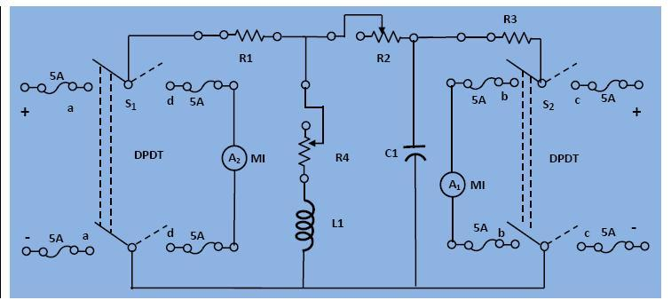

### Procedure

								<b>Circuit Diagram:</b>
								 <figure style="text-align:center">
									  
									  <figcaption>[Fig 1: Circuit digram of experimental set-up for analysis of reciprocity theorem.]</figcaption>
								</figure> 
								 
								

								<ol type="a">
								<li>Simulate any network with suitable value of R, L, and C such that the short circuit currents in all branches are within safe limit.
								 Apply a small voltage at a-a and measure the short circuit current at b-b. Check the ratio =Va-a /Ib-b.</li>
								<li>Now apply a voltage across c-c after open circuiting it and measure the current through d-d after shorting them. 
								find the ratio=Vc-c /Id-d.</li> 
								The two ratio should be identical that is,
								
									
$$\frac{V_{a-a}}{I_{b-b}}=\frac{V_{c-c}}{I_{d-d}}$$									
								

								</ol>
								

							
                  