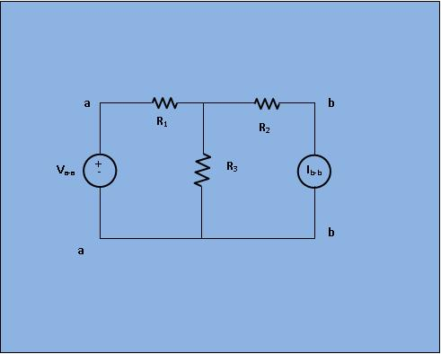
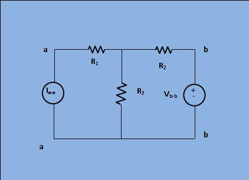

### Theory

 &nbsp&nbsp&nbsp In any branch of a network , the current (I) due to a single source  of voltage (V) elsewhere in the network is equal to the current
through the branch in which the source was originally placed when the source is placed in the branch in which the current (I) was originally obtained.   
In simple sence , the location of the voltage source and the through current maybe interchange without a change in current . However 
the polarity of the voltage source should have identically with the dirction of branch current in each position.The limitation of this
theorem is that it is applicable only to single source natworks and not in multisource network. Moreover, the network where reciprocity
theorem is applied should be linear one containing resistors, inductors, capacitors and coupled circuits.   
In figure 1, apply a small voltage at a-a and measure the short circuit current at b-b. Check the ratio =Va-a /Ib-b

									 <figure style="text-align:center">
									  
									  <figcaption>[Fig 1: Circuit for analysis of reciprocity theorem with source along a-a]</figcaption>
									</figure 
									 
In figure 2, apply a small voltage at b-b and measure the short circuit current at a-a. Check the ratio = Vb-b/Ia-a.

									 <figure style="text-align:center">
									  
									  <figcaption>[Fig 2: Circuit for analysis of reciprocity theorem with source along b-b]</figcaption>
									</figure 
									   